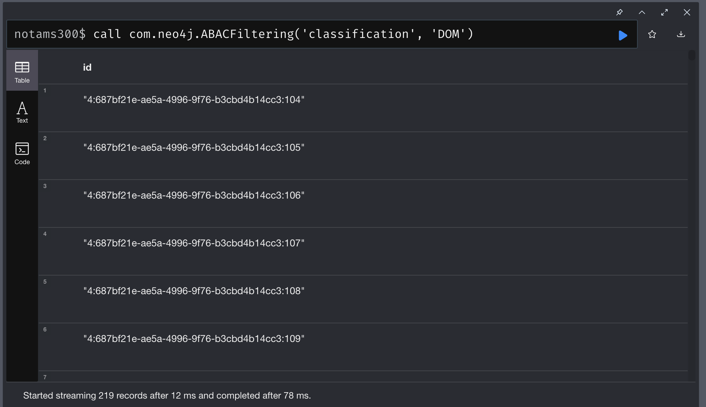
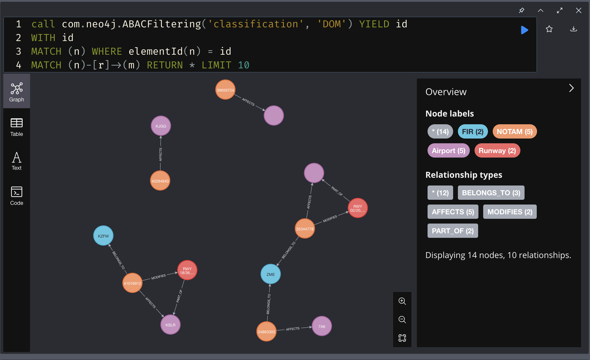

# How To Use The Plugin

<b>Prerequisites</b>

- `accumulo-access` plugin is installed.

 

<b>Dataset</b>

The picture below shows an example of node and relation for [NOTAMs](https://www.faa.gov/about/initiatives/notam/what_is_a_notam) data where organe node represents a NOTAM and pink node represents an Airport. There is an `AFFECT` relationship connecting NOTAM and Airport.

On the right hand side of the picture you can see the list of properties of a NOTAM node. What we are interested in is the `classification` property. The value of the selected node for this property is `DOM`.

Our goal is to select nodes where its `classification` matches user's authorizations attribute.

 

<b>Calling The Procedure</b>

What has been implemented in the plugin is a procedure called `com.neo4j.ABACFiltering`.

The following picture shows an exampleo of calling the procedure from Neo4j's console.

The first argument to the call is the name of the property field from which we are getting the ABAC security label value. Second argument is the authorization string which is going to be used to evaluate against the security label.

`DOM` in this example is the authorization string. It can be a comma separated string such as `DOM,MIL,FDC`.

Currently this plugin only supports evaluating against a Node's property value but not Relationship's. Future improvement can be made to extend to support that.

 

<b>Using the Procedure Output</b>

When procedure is executed, it is wrapped around within a transaction. What that means is that we could not return the matching Node or Relationship in the output since the context has been closed. What we can do instead is to return ids of the matching Node as you see from the picture above. Once we have the ids, we can find the matching Nodes.

An example of this is shown below.

We use the ids returned from the procedure call to look up Nodes that have the ids (line 1 ~ 3) and follows by the actual Neo4j query (line 4) you like to execute.

 
